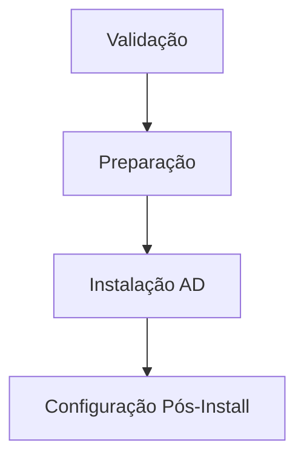

# 📊 Análise de Repositório - AD Deployment PowerShell

## Estrutura Atual vs. Recomendada

### ✅ Pontos Fortes Identificados
1. **Modularização clara** - Separação de responsabilidades em módulos
2. **Sistema de logging robusto** - Implementação de classes para logs
3. **Gerenciamento de estado** - Rastreamento de progresso entre reboots
4. **Testes unitários** - Pasta Test/ com validações
5. **Documentação presente** - README.md detalhado

---

## 🔧 Recomendações de Melhoria

### 1. **Estrutura de Diretórios**

#### ❌ Estrutura Atual
```
PsScripts/
├── Config/
├── Functions/
├── Modules/
├── Test/
├── Logs/
├── Deploy.ps1
├── Deploy-Part2.ps1
└── Deploy-AutoContinue.ps1
```

#### ✅ Estrutura Recomendada (PSScriptAnalyzer + Best Practices)
```
ADDeployment/
├── .vscode/                    # Configurações do VS Code
│   ├── settings.json
│   ├── tasks.json
│   └── launch.json
├── Config/
│   ├── Default.psd1
│   ├── Test.psd1
│   ├── Production.psd1
│   └── README.md              # Documentação de configuração
├── Docs/                      # Documentação detalhada
│   ├── Architecture.md
│   ├── Installation.md
│   ├── Troubleshooting.md
│   └── API-Reference.md
├── Examples/                  # Exemplos de uso
│   ├── Basic-Deployment.ps1
│   └── Custom-Configuration.ps1
├── Private/                   # Funções privadas (não exportadas)
│   ├── Helpers/
│   └── Internal/
├── Public/                    # Funções públicas (exportadas)
│   ├── Configuration/
│   ├── Installation/
│   ├── PostConfiguration/
│   └── Validation/
├── Resources/                 # Recursos estáticos
│   └── Templates/
├── Tests/                     # Testes (renomear Test -> Tests)
│   ├── Unit/
│   ├── Integration/
│   └── E2E/
├── Build/                     # Scripts de build/CI
│   └── build.ps1
├── .github/                   # GitHub workflows
│   └── workflows/
│       └── ci.yml
├── Deploy.ps1                 # Script principal
├── Deploy-Part2.ps1
├── ADDeployment.psd1          # Manifest do módulo
├── ADDeployment.psm1          # Módulo raiz
├── CHANGELOG.md
├── CONTRIBUTING.md
├── LICENSE
└── README.md
```

---

### 2. **Manifesto de Módulo (Module Manifest)**

#### ❌ Problema: Sem .psd1 manifest
Atualmente, os módulos não têm manifests, dificultando:
- Versionamento
- Gestão de dependências
- Metadados do projeto
- Publicação no PowerShell Gallery

#### ✅ Solução: Criar ADDeployment.psd1

**Estrutura recomendada:**
```powershell
@{
    ModuleVersion = '2.2.0'
    GUID = '<gerar-novo-guid>'
    Author = 'BRMC IT Team'
    CompanyName = 'BRMC'
    Copyright = '(c) 2025 BRMC IT Team. All rights reserved.'
    Description = 'Active Directory Domain Controller deployment automation'
    
    PowerShellVersion = '5.1'
    
    RequiredModules = @(
        @{ModuleName='ActiveDirectory'; ModuleVersion='1.0.0.0'}
    )
    
    FunctionsToExport = @(
        'Invoke-ADDeployment',
        'Invoke-ADPostConfiguration',
        'Test-ADConfigValidation'
    )
    
    PrivateData = @{
        PSData = @{
            Tags = @('ActiveDirectory', 'Deployment', 'Automation', 'Windows')
            LicenseUri = 'https://github.com/brmc/ad-deployment/blob/main/LICENSE'
            ProjectUri = 'https://github.com/brmc/ad-deployment'
            ReleaseNotes = 'See CHANGELOG.md'
        }
    }
}
```

---

### 3. **Nomenclatura de Arquivos**

#### ❌ Problemas Atuais
- Inconsistência: `Deploy.ps1` vs `Deploy-Part2.ps1`
- Falta de convenção clara
- Nomes genéricos em Functions/

#### ✅ Padrões Recomendados

**Scripts:**
- `Deploy.ps1` → `Start-ADDeployment.ps1`
- `Deploy-Part2.ps1` → `Complete-ADDeployment.ps1`
- `Deploy-AutoContinue.ps1` → `Resume-ADDeployment.ps1`

**Modules:**
- `ADDeployment.Config.psm1` ✓ (correto)
- `ADDeployment.Validate.psm1` ✓ (correto)
- `ADDeployment.Setup.psm1` ✓ (correto)
- `ADDeployment.Install.psm1` ✓ (correto)
- `ADDeployment.PostConfig.psm1` ✓ (correto)

**Functions:**
- `Utilities.Install.ps1` → `Private/Install-Utilities.ps1`
- `Utilities.ADManagement.ps1` → `Private/AD-Management.ps1`
- `Utilities.ADPolicies.ps1` → `Private/AD-Policies.ps1`

**Tests:**
- Renomear pasta `Test/` → `Tests/`
- Padrão: `*.Tests.ps1` (ex: `ADDeployment.Config.Tests.ps1`)

---

### 4. **Versionamento e Controle de Mudanças**

#### ❌ Ausente
- Sem `CHANGELOG.md`
- Versões espalhadas nos comentários
- Sem semantic versioning consistente

#### ✅ Implementar

**CHANGELOG.md:**
```markdown
# Changelog

## [2.2.0] - 2025-02-12
### Added
- Correção de validação CIDR
- Suporte a múltiplos segmentos de rede
### Fixed
- Bug de cálculo de range de rede
### Changed
- Refatoração de módulos para padrão PSScriptAnalyzer
```

**Versioning Strategy:**
- Usar Semantic Versioning (SemVer): `MAJOR.MINOR.PATCH`
- Atualizar em `ADDeployment.psd1`
- Tag releases no Git

---

### 5. **Gestão de Configuração**

#### ❌ Problemas
- `.gitignore` bloqueia `Config/Default.psd1` (linha 295)
- Sem exemplos de configuração
- Sem validação de schema

#### ✅ Soluções

**Estrutura recomendada:**
```
Config/
├── Default.psd1.example       # Template seguro
├── Test.psd1.example
├── Production.psd1.example
├── schema.psd1                # Schema de validação
└── README.md
```

**.gitignore ajustado:**
```gitignore
# Ignorar configs com dados sensíveis
Config/*.psd1
!Config/*.example
!Config/schema.psd1
```

**Adicionar validação de schema:**
```powershell
function Test-ConfigSchema {
    param([hashtable]$Config)
    
    # Validar estrutura contra schema
    # Retornar erros específicos
}
```

---

### 6. **Logging e Telemetria**

#### ❌ Situação Atual
- Logs misturados com estado
- Sem rotação de logs
- Sem níveis de verbosidade configuráveis

#### ✅ Melhorias

**Estrutura de Logs:**
```
Logs/
├── Deployment/
│   ├── 2025-02-12_Phase1.log
│   └── 2025-02-12_Phase2.log
├── Errors/
│   └── 2025-02-12_Errors.log
├── Debug/
│   └── 2025-02-12_Debug.log
└── State/
    └── deployment.state.json
```

**Implementar:**
- Log rotation (manter últimos 30 dias)
- Níveis: Debug, Info, Warning, Error, Critical
- Formato estruturado (JSON opcional)
- Export de logs para análise

---

### 7. **Testes**

#### ❌ Problemas
- Testes manuais
- Sem integração contínua
- Sem cobertura de código
- Sem testes de integração

#### ✅ Framework Recomendado: Pester

**Estrutura:**
```
Tests/
├── Unit/
│   ├── Config.Tests.ps1
│   ├── Validate.Tests.ps1
│   └── Setup.Tests.ps1
├── Integration/
│   └── FullDeployment.Tests.ps1
├── E2E/
│   └── EndToEnd.Tests.ps1
└── TestHelpers.psm1
```

**Exemplo Pester v5:**
```powershell
Describe 'ADDeployment.Config' {
    BeforeAll {
        Import-Module ./Modules/ADDeployment.Config.psm1
    }
    
    Context 'Import-ADConfig' {
        It 'Should load valid config' {
            $config = Import-ADConfig -ConfigFile './Config/Test.psd1'
            $config | Should -Not -BeNullOrEmpty
        }
        
        It 'Should throw on invalid file' {
            { Import-ADConfig -ConfigFile './Invalid.psd1' } | 
                Should -Throw
        }
    }
}
```

---

### 8. **Documentação**

#### ❌ Falta
- API reference
- Guia de contribuição
- Troubleshooting detalhado
- Exemplos práticos

#### ✅ Criar

**Docs/Architecture.md:**
```markdown
# Arquitetura do Sistema

## Fluxo de Deployment



## Componentes
...
```

**CONTRIBUTING.md:**
```markdown
# Contribuindo

## Como Contribuir
1. Fork o repositório
2. Crie uma branch (`git checkout -b feature/nova-funcionalidade`)
3. Commit suas mudanças
4. Push para a branch
5. Abra um Pull Request

## Padrões de Código
- Use PSScriptAnalyzer
- Siga Verb-Noun naming
- Adicione testes
```

---

### 9. **Segurança**

#### ❌ Riscos Identificados
- Senhas em plaintext no código
- Sem SecretManagement
- Logs podem conter dados sensíveis

#### ✅ Implementar

**Usar Microsoft.PowerShell.SecretManagement:**
```powershell
# Registrar vault
Register-SecretVault -Name ADDeployment -ModuleName SecretStore

# Armazenar credenciais
Set-Secret -Name DSRMPassword -Secret $securePassword

# Recuperar
$dsrmPwd = Get-Secret -Name DSRMPassword -AsPlainText
```

**Sanitizar logs:**
```powershell
function Write-SafeLog {
    param($Message)
    
    # Remover padrões sensíveis
    $sanitized = $Message -replace 'password=\S+', 'password=***'
    $Logger.Info($sanitized)
}
```

---

### 10. **Automação e CI/CD**

#### ❌ Ausente
- Sem pipeline de CI/CD
- Build manual
- Sem testes automáticos

#### ✅ GitHub Actions

**.github/workflows/ci.yml:**
```yaml
name: CI

on: [push, pull_request]

jobs:
  test:
    runs-on: windows-latest
    steps:
      - uses: actions/checkout@v3
      
      - name: Run PSScriptAnalyzer
        shell: pwsh
        run: |
          Install-Module -Name PSScriptAnalyzer -Force
          Invoke-ScriptAnalyzer -Path . -Recurse
      
      - name: Run Pester Tests
        shell: pwsh
        run: |
          Install-Module -Name Pester -Force
          Invoke-Pester -Path ./Tests -Output Detailed
```

---

### 11. **Performance e Otimização**

#### 🐌 Pontos de Melhoria

**Carregamento de Módulos:**
```powershell
# ❌ Atual: Dot sourcing múltiplo
. "$PSScriptRoot\Functions\Utilities.Install.ps1"
. "$PSScriptRoot\Functions\Utilities.ADManagement.ps1"

# ✅ Recomendado: Module autoloading
# No ADDeployment.psm1:
$Public = @(Get-ChildItem -Path $PSScriptRoot\Public\*.ps1 -ErrorAction SilentlyContinue)
$Private = @(Get-ChildItem -Path $PSScriptRoot\Private\*.ps1 -ErrorAction SilentlyContinue)

foreach ($import in @($Public + $Private)) {
    . $import.FullName
}

Export-ModuleMember -Function $Public.BaseName
```

---

### 12. **Compatibilidade**

#### ⚠️ Considerações

**PowerShell Core vs. Windows PowerShell:**
```powershell
# Adicionar verificações de compatibilidade
#Requires -Version 5.1
#Requires -RunAsAdministrator
#Requires -Modules ActiveDirectory, GroupPolicy

# No manifest:
PowerShellVersion = '5.1'
CompatiblePSEditions = @('Desktop')  # Ou @('Desktop', 'Core')
```

---

### 13. **Error Handling**

#### ❌ Inconsistente
- Alguns try/catch faltando
- Mensagens de erro genéricas
- Sem códigos de erro padronizados

#### ✅ Padrão Recomendado

**Criar módulo de exceções:**
```powershell
# Private/Exceptions.ps1

class ADDeploymentException : System.Exception {
    [int]$ErrorCode
    
    ADDeploymentException([string]$message, [int]$code) : base($message) {
        $this.ErrorCode = $code
    }
}

class ConfigValidationException : ADDeploymentException {
    ConfigValidationException([string]$message) : base($message, 1001) {}
}

# Uso:
throw [ConfigValidationException]::new("Invalid domain name")
```

**Error codes:**
```
1000-1999: Configuration errors
2000-2999: Validation errors
3000-3999: Installation errors
4000-4999: Post-configuration errors
```

---

### 14. **Code Quality**

#### 📏 PSScriptAnalyzer

**Criar .vscode/settings.json:**
```json
{
    "powershell.scriptAnalysis.enable": true,
    "powershell.scriptAnalysis.settingsPath": "./.vscode/PSScriptAnalyzerSettings.psd1",
    "powershell.codeFormatting.preset": "OTBS"
}
```

**.vscode/PSScriptAnalyzerSettings.psd1:**
```powershell
@{
    Rules = @{
        PSAvoidUsingCmdletAliases = @{
            Enable = $true
        }
        PSAvoidUsingWriteHost = @{
            Enable = $false  # Permitir Write-Host para feedback
        }
        PSUseApprovedVerbs = @{
            Enable = $true
        }
    }
}
```

---

### 15. **Internationalization (i18n)**

#### 🌍 Suporte Multi-idioma

**Estrutura:**
```
Resources/
├── Strings/
│   ├── en-US.psd1
│   └── pt-BR.psd1
```

**en-US.psd1:**
```powershell
ConvertFrom-StringData @'
    ErrorConfigNotFound = Configuration file not found: {0}
    SuccessADInstalled = Active Directory installed successfully
    WarningRebootRequired = Reboot required to continue
'@
```

**Uso:**
```powershell
Import-LocalizedData -BindingVariable Strings -FileName Strings
Write-Host $Strings.SuccessADInstalled -ForegroundColor Green
```

---

## 📊 Resumo de Prioridades

### 🔴 Crítico (Implementar Primeiro)
1. ✅ Criar Module Manifest (ADDeployment.psd1)
2. ✅ Separar Public/Private functions
3. ✅ Implementar gestão segura de senhas
4. ✅ Corrigir .gitignore para configs

### 🟡 Importante (Segunda Fase)
5. ✅ Migrar testes para Pester
6. ✅ Adicionar CHANGELOG.md
7. ✅ Criar documentação em Docs/
8. ✅ Implementar CI/CD pipeline

### 🟢 Desejável (Melhorias Futuras)
9. ✅ Adicionar i18n
10. ✅ Otimizar performance
11. ✅ Expandir exemplos
12. ✅ Code coverage reporting

---

## 🛠️ Plano de Ação Sugerido

### Fase 1: Reorganização (1-2 dias)
- [ ] Reestruturar diretórios
- [ ] Criar manifest
- [ ] Renomear arquivos conforme convenção
- [ ] Atualizar imports/exports

### Fase 2: Qualidade (2-3 dias)
- [ ] Migrar testes para Pester
- [ ] Configurar PSScriptAnalyzer
- [ ] Implementar error handling padronizado
- [ ] Adicionar SecretManagement

### Fase 3: Documentação (1-2 dias)
- [ ] Criar Docs/ completo
- [ ] CONTRIBUTING.md
- [ ] CHANGELOG.md
- [ ] Exemplos práticos

### Fase 4: Automação (1 dia)
- [ ] Setup GitHub Actions
- [ ] Build script
- [ ] Release automation

---

## 📚 Recursos Recomendados

### Ferramentas
- **PSScriptAnalyzer**: Análise de código
- **Pester**: Framework de testes
- **platyPS**: Geração de help
- **ModuleBuilder**: Build automation

### Referências
- [PowerShell Best Practices](https://docs.microsoft.com/powershell/scripting/dev-cross-plat/performance/script-authoring-considerations)
- [PowerShell Gallery Publishing](https://docs.microsoft.com/powershell/scripting/gallery/how-to/publishing-packages/publishing-a-package)
- [The PowerShell Style Guide](https://poshcode.gitbook.io/powershell-practice-and-style/)

---

## ✅ Checklist de Conformidade

```markdown
- [ ] Module Manifest presente e completo
- [ ] Estrutura de diretórios padronizada
- [ ] Nomenclatura consistente (Verb-Noun)
- [ ] Funções públicas/privadas separadas
- [ ] Testes unitários com Pester
- [ ] Documentação completa
- [ ] CI/CD configurado
- [ ] PSScriptAnalyzer sem warnings
- [ ] Versionamento semântico
- [ ] CHANGELOG atualizado
- [ ] Gestão segura de credenciais
- [ ] Error handling robusto
- [ ] Logs estruturados
- [ ] Exemplos de uso
- [ ] Licença definida
```

---

## 🎯 Conclusão

O repositório possui uma **base sólida** com boa modularização e separação de responsabilidades. As principais melhorias são:

1. **Formalizar** a estrutura com manifests e convenções
2. **Profissionalizar** testes e CI/CD
3. **Documentar** adequadamente
4. **Securizar** gestão de credenciais

Implementando estas recomendações, o projeto estará alinhado com os **padrões enterprise** de desenvolvimento PowerShell.